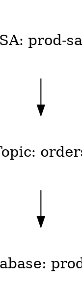
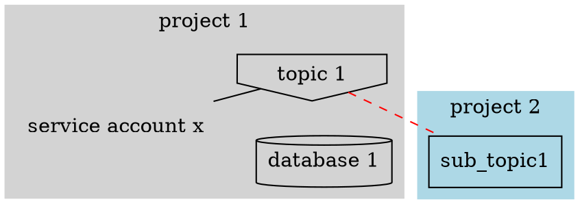
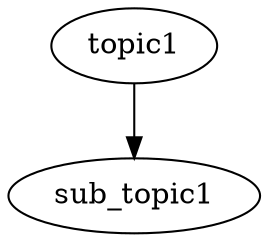

# Research: GCP Resource Visualizer MVP Architecture Decisions

**Date**: 2025-11-05T20:02:52+01:00
**Researcher**: Claude
**Git Commit**: 72c578b4927b9d1a963e516668e33d471976984b
**Branch**: main
**Repository**: gcp-visualizer

## Research Question

Research architectural decisions for building a GCP resource visualization CLI tool MVP that:
- Visualizes Service Account and Pub/Sub topic/subscription relationships
- Scales to 1000+ resources
- Avoids building a frontend (prefers existing visualization tools with APIs)
- Can later add Terraform management status visualization

## Summary

Based on comprehensive research, the recommended architecture combines:
1. **Data Collection**: Cloud Asset Inventory API with the Go SDK for fetching GCP resources and relationships
2. **Graph Generation**: Graphviz with go-graphviz library using the SFDP layout engine for scalable visualization
3. **Optional Enhancement**: Steampipe for SQL-based exploration and existing relationship queries

This approach provides a pure Go solution with no external dependencies that can handle 1000+ resources effectively.

## Detailed Findings

### Visualization Tools Analysis

#### Recommended: Graphviz with SFDP Engine

**Why Graphviz**:
- **Proven scalability**: SFDP engine handles 70,000+ nodes efficiently (tested with 1,054 nodes in seconds)
- **Pure Go integration**: go-graphviz provides embedded WASM implementation
- **No external dependencies**: Complete solution in Go
- **Multiple output formats**: SVG, PNG, PDF supported
- **30+ years of development**: Most mature graph visualization tool

**Implementation approach**:
```go
import "github.com/goccy/go-graphviz"

g := graphviz.New(ctx)
graph, _ := g.Graph()
// Build your GCP resource graph
graph.SetLayout(graphviz.SFDP) // Critical: Use sfdp for large graphs
g.RenderFilename(graph, graphviz.SVG, "output.svg")
```

**Key optimization settings for 1000+ nodes**:
- Use `sfdp` layout engine (NOT `dot` which struggles at 500+ nodes)
- Set `overlap=scale` for better node distribution
- Use `splines=line` for performance boost
- Adjust `K` parameter to control node spacing

#### Alternative for Small Visualizations: D2

If typical use case is under 500 nodes and aesthetics are priority:
- Modern, clean syntax
- Best-looking output with ELK layout engine
- Native Go library
- Active development
- **Explicit limitation**: Not tested on thousands of nodes

#### Not Recommended for This Use Case

**Mermaid**:
- Hard-coded 280 edge limit
- Performance degrades significantly with large graphs
- JavaScript/Node.js dependency

**PlantUML**:
- Requires Java runtime
- Slower performance on large graphs
- Less suitable for network diagrams

### GCP Data Collection Architecture

#### Primary Approach: Cloud Asset Inventory API

**Installation**:
```bash
go get cloud.google.com/go/asset/apiv1@latest
go get cloud.google.com/go/pubsub
```

**Key capabilities**:
- Organization-wide resource discovery with single API call
- RELATIONSHIP content type for tracking dependencies
- Cross-project resource access patterns
- 35-day history of changes
- Export to BigQuery for large-scale analysis

**Service Account Permission Discovery**:
```go
// Analyze IAM policies to find service account permissions
func analyzeSAPermissions(client *asset.Client, orgID, saEmail string) {
    req := &assetpb.AnalyzeIamPolicyRequest{
        AnalysisQuery: &assetpb.IamPolicyAnalysisQuery{
            Scope: fmt.Sprintf("organizations/%s", orgID),
            IdentitySelector: &assetpb.IamPolicyAnalysisQuery_IdentitySelector{
                Identity: fmt.Sprintf("serviceAccount:%s", saEmail),
            },
            Options: &assetpb.IamPolicyAnalysisQuery_Options{
                AnalyzeServiceAccountImpersonation: true,
                ExpandGroups: true,
                ExpandRoles: true,
            },
        },
    }

    resp, err := client.AnalyzeIamPolicy(ctx, req)
    // Process results showing what resources SA can access
}
```

**Pub/Sub Relationship Discovery**:
```go
// Discover topic-subscription relationships
func discoverPubSubRelationships(client *pubsub.Client) {
    // List all subscriptions and their topics
    subIter := client.Subscriptions(ctx)
    for {
        sub, err := subIter.Next()
        if err == iterator.Done {
            break
        }

        config, err := sub.Config(ctx)
        // config.Topic contains the topic reference
        fmt.Printf("Subscription: %s -> Topic: %s\n", sub.ID(), config.Topic.ID())
    }

    // List all topics and their subscriptions
    topicIter := client.Topics(ctx)
    for {
        topic, err := topicIter.Next()
        // topic.Subscriptions() lists all subscriptions
    }
}
```

**Cross-Project Discovery**:
```go
// Query resources across multiple projects from organization scope
req := &assetpb.SearchAllResourcesRequest{
    Scope: fmt.Sprintf("organizations/%s", orgID),
    AssetTypes: []string{
        "pubsub.googleapis.com/Topic",
        "pubsub.googleapis.com/Subscription",
    },
    PageSize: 500,
}
```

#### API Quotas and Rate Limits

**Critical quotas for large-scale discovery**:

| Operation | Project Limit/min | Org Limit/min |
|-----------|------------------|---------------|
| SearchAllResources | 400 | 1,500 |
| ListAssets | 100 | 800 |
| AnalyzeIamPolicy | 100 | - |

**Rate limiting strategy**:
- Implement exponential backoff for ResourceExhausted errors
- Use BigQuery exports for batch processing (doesn't count against quotas)
- Partition queries by project/folder
- Request quota increases for Premium/Enterprise tier

### Existing Tools Evaluation

#### Most Relevant: Steampipe + GCP Plugin

**Advantages**:
- 121+ GCP resource types including service accounts and Pub/Sub
- SQL-based querying without database requirement
- GCP Insights Mod provides pre-built relationship graphs
- Can be integrated into CLI tools
- GraphQL endpoint for programmatic access

**Integration path**:
1. Use Steampipe to query GCP data via SQL
2. Build Go CLI that queries Steampipe
3. Generate visualizations from query results

#### Alternative: CloudGraph

**Advantages**:
- GraphQL API designed for resource relationships
- Stores in Dgraph (graph database)
- Full relationship mapping between resources
- Docker-based deployment

**Limitations**:
- Requires Docker and Dgraph
- More complex setup than direct API approach

#### Security-Focused: GCP Scanner

**Advantages**:
- Assesses service account credential access levels
- Built-in visualizer (web-based)
- Supports Pub/Sub, Service Accounts, and other GCP resources
- Python-based with JSON output

**Limitations**:
- Security-focused rather than general visualization
- Linux-only
- Would require Python integration

## Architecture Recommendations

### MVP Architecture (Recommended)

```
┌─────────────────┐
│   Go CLI Tool   │
└────────┬────────┘
         │
    ┌────▼────┐
    │ Collect │ (Cloud Asset Inventory API + Pub/Sub API)
    └────┬────┘
         │
    ┌────▼────┐
    │  Build  │ (Internal graph structure)
    └────┬────┘
         │
    ┌────▼────┐
    │ Render  │ (go-graphviz with SFDP engine)
    └────┬────┘
         │
    ┌────▼────┐
    │ Output  │ (SVG/PNG/PDF files)
    └─────────┘
```

**Implementation Steps**:

1. **Data Collection Module**:
   - Use Cloud Asset Inventory API for service account IAM bindings
   - Use Pub/Sub API for topic/subscription relationships
   - Handle cross-project resources via organization-level queries

2. **Graph Building Module**:
   - Create internal graph representation
   - Track nodes (service accounts, topics, subscriptions)
   - Track edges (publishes-to, subscribes-to, has-permission-on)

3. **Visualization Module**:
   - Use go-graphviz with SFDP layout for 1000+ nodes
   - Implement clustering by project or service
   - Support multiple output formats

4. **Configuration**:
   - YAML/JSON config for filtering resources
   - Layout preferences
   - Output format selection

### Hybrid Approach (Future Enhancement)

For enhanced capabilities, consider adding:

1. **Steampipe Integration**:
   - Use for SQL-based exploration
   - Pre-built relationship queries
   - Interactive dashboards

2. **BigQuery Export**:
   - For organizations with 10,000+ resources
   - Complex relationship analysis via SQL
   - Historical tracking

3. **D2 for Small Graphs**:
   - Auto-detect graph size
   - Use D2 for <500 nodes (better aesthetics)
   - Use Graphviz for 500+ nodes (better performance)

## Implementation Considerations

### Required IAM Permissions

Minimum permissions for the tool's service account:
- `roles/cloudasset.viewer` - Read asset metadata
- `roles/iam.securityReviewer` - Analyze IAM policies
- `roles/pubsub.viewer` - List topics and subscriptions
- Organization-level access for cross-project discovery

### Performance Optimizations

1. **Parallel Processing**:
   - Query multiple projects concurrently
   - Batch API requests where possible

2. **Caching**:
   - Cache discovered resources locally
   - Implement TTL for refresh

3. **Filtering**:
   - Allow resource type filtering
   - Project/folder scoping
   - Label-based filtering

4. **Progressive Rendering**:
   - Start with high-level view
   - Allow drill-down into specific services

### Terraform Integration (Phase 2)

For detecting Terraform-managed resources:
- Parse Terraform state files (`.tfstate`)
- Use resource IDs to match with discovered resources
- Add visual indicators (color, shape, label) for managed resources

## Cost Considerations

1. **Cloud Asset Inventory API**:
   - First 1 million API calls free per month
   - $0.01 per 1,000 API calls after

2. **Pub/Sub API**:
   - Admin operations are free
   - No charges for listing/describing

3. **BigQuery (if used)**:
   - $5 per TB for queries
   - Storage costs for exported data

## Open Questions

1. **Resource Grouping Strategy**: How should resources be grouped in large visualizations? By project, service, or custom tags?

2. **Interactive Features**: Is a static image sufficient, or would interactive HTML with zoom/pan be valuable?

3. **Update Frequency**: How often should the visualization be regenerated? Real-time, daily, or on-demand?

4. **Access Pattern Details**: Should the tool show specific IAM roles/permissions or just connection existence?

5. **Terraform State Location**: Where are Terraform state files stored? GCS, local, or Terraform Cloud?

## Follow-up Research Topics

1. **Graph Layout Algorithms**: Research optimal layouts for service dependency graphs
2. **Incremental Updates**: Methods for updating visualizations without full regeneration
3. **Multi-Cloud Extension**: Feasibility of extending to AWS/Azure
4. **Cost Optimization**: Strategies for minimizing API calls in large organizations

---

## Follow-up Research [2025-11-05 20:15]

Based on your clarifying questions and the example.png reference, I conducted additional research on Graphviz capabilities, frontend options, data persistence strategies, and IAM binding details.

### CRITICAL FINDING: SFDP Does Not Support Clusters

**This changes the initial recommendation significantly.**

The initial recommendation to use SFDP layout engine is **incorrect for your use case**. SFDP **does not support clusters at all** - cluster definitions are completely ignored. Since you want project boundaries (as shown in example.png), you cannot use SFDP.

**Revised Recommendation**: Use **FDP** (Force-Directed Placement) or **DOT** layout engines instead.

### 1. Graphviz Custom Shapes and Clustering

#### Custom Images and Icons

**Yes, Graphviz supports custom images**, but with specific requirements:



**Key Requirements**:
- Must use `shape=none` or `box` (NOT `record`)
- Only local file paths supported (no HTTP URLs)
- SVG files must have explicit width/height attributes
- Download GCP icons from https://cloud.google.com/icons or https://gcpicons.com/

**Alternative Shapes**:
- `cylinder` - Databases
- `invhouse` - Pub/Sub topics
- `box` - Subscriptions
- `component` - Services/Functions

#### Project Clustering (Like Your Example)

**Using FDP Layout** (Recommended for organic layouts):



**Using DOT Layout** (For hierarchical layouts):



**Layout Engine Comparison for Your Use Case**:

| Feature | DOT | FDP | SFDP |
|---------|-----|-----|------|
| **Project Clusters** | ✅ Full support | ✅ Full support | ❌ **Not supported** |
| **Custom Images** | ✅ Yes | ✅ Yes | ✅ Yes |
| **1000+ Nodes** | ❌ Very slow | ⚠️ Slow (quadratic) | ✅ Fast |
| **Cross-cluster Edges** | ✅ With compound=true | ✅ Direct edges | ❌ No |
| **Layout Style** | Hierarchical | Organic/Force | Spring model |

**Final Recommendation**:
- **Use FDP** for 30-40 projects with ~1000 resources (will handle it, but may take 30-60 seconds)
- **Use DOT** if you have hierarchical relationships (service accounts → topics → subscriptions)
- Consider generating **separate visualizations per project** for very large datasets, then use `gvpack` to combine

### 2. Frontend Options - The Brutal Honest Truth

#### Option A: Static SVG Files (Recommended for MVP)

**Complexity**: ⭐ Very Low
**Time Investment**: Already covered by go-graphviz
**Maintenance**: Zero

**Why this is the best starting point**:
- SVG files are **already interactive** - they support zoom, pan in browsers
- Modern browsers can open SVG directly with smooth zoom
- Tools like Inkscape or web-based SVG viewers provide excellent UX
- Zero maintenance burden
- Focus on the core problem (data collection and graph building)

**User Experience**:
```bash
$ gcp-visualizer scan --projects project1,project2 --output diagram.svg
$ open diagram.svg  # Opens in browser with zoom/pan
```

**Verdict**: Start here. Don't build a frontend until static SVG is insufficient.

---

#### Option B: Go + HTML Templates (Medium Pain)

**Complexity**: ⭐⭐⭐ Medium-High
**Time Investment**: 2-4 weeks for basic interactivity
**Maintenance**: Medium

**Realistic Assessment**:

Go's `html/template` is great for **server-rendered pages**, but terrible for **interactive visualizations**. You would need:

1. **Embed JavaScript anyway** - Go templates just deliver HTML
2. **Learn a JS graph library** - Back to square one
3. **Build a web server** - Defeats the purpose of a CLI tool

**Example of what you'd actually build**:

```go
// server.go
func main() {
    http.HandleFunc("/", func(w http.ResponseWriter, r *http.Request) {
        tmpl := template.Must(template.ParseFiles("index.html"))
        data := loadGraphData()  // Load your GCP data
        tmpl.Execute(w, data)
    })
    http.ListenAndServe(":8080", nil)
}
```

```html
<!-- index.html -->
<!DOCTYPE html>
<html>
<head>
    <script src="https://d3js.org/d3.v7.min.js"></script>
</head>
<body>
    <div id="graph"></div>
    <script>
        // Still need to write all this JavaScript!
        const data = {{.GraphData}};
        const svg = d3.select("#graph").append("svg");
        // 500+ lines of D3.js code...
    </script>
</body>
</html>
```

**Brutal Truth**: You're just wrapping JavaScript in Go. The hard part (interactive graph rendering) is still 100% JavaScript.

**Go Libraries That Might Help**:
- **gojs** (github.com/dop251/goja) - Run JavaScript in Go (doesn't solve the problem)
- **chromedp** (github.com/chromedp/chromedp) - Headless Chrome (overkill, adds complexity)

**Verdict**: ❌ **Don't do this.** Go templates don't reduce JavaScript complexity at all.

---

#### Option C: JavaScript Libraries (Most Practical for Interactive)

**Complexity**: ⭐⭐⭐⭐ High
**Time Investment**: 4-8 weeks for production-ready
**Maintenance**: High

**If you decide interactive features are essential**, here's the honest assessment:

##### D3.js
- **Learning Curve**: ⭐⭐⭐⭐⭐ Steep (weeks to months)
- **Power**: Maximum flexibility
- **1000+ Nodes**: Possible but requires optimization
- **Brutal Truth**: D3 is a **low-level toolkit**, not a graph library. You build everything from scratch.
- **Time Investment**: 100+ hours for a polished graph visualization

**Example Complexity**:
```javascript
// Just to draw nodes and edges is 200+ lines
const simulation = d3.forceSimulation(nodes)
    .force("link", d3.forceLink(links))
    .force("charge", d3.forceManyBody())
    .force("center", d3.forceCenter(width / 2, height / 2));

// Then you need zoom, drag, tooltips, filtering, etc.
```

##### Cytoscape.js
- **Learning Curve**: ⭐⭐⭐ Moderate
- **Power**: Graph-specific, less flexible than D3
- **1000+ Nodes**: Designed for it
- **Brutal Truth**: Much easier than D3 for graphs, but still significant JavaScript
- **Time Investment**: 40-60 hours

```javascript
const cy = cytoscape({
  container: document.getElementById('cy'),
  elements: [
    { data: { id: 'sa1', label: 'Service Account' } },
    { data: { id: 'topic1', label: 'Topic' } },
    { data: { source: 'sa1', target: 'topic1' } }
  ],
  style: [ /* styling */ ],
  layout: { name: 'cose' }  // Force-directed layout
});
```

**Better than D3**, but still requires:
- Build system (Webpack/Vite)
- Package management (npm)
- Styling and theming
- Export functionality
- Responsive design

##### Vis.js (Easiest JavaScript Option)
- **Learning Curve**: ⭐⭐ Easy
- **Power**: Less flexible, more batteries-included
- **1000+ Nodes**: Can handle it
- **Brutal Truth**: Simplest option, but less customizable
- **Time Investment**: 20-30 hours

```javascript
const container = document.getElementById('mynetwork');
const data = {
  nodes: new vis.DataSet([/* nodes */]),
  edges: new vis.DataSet([/* edges */])
};
const options = { /* config */ };
const network = new vis.Network(container, data, options);
```

**Verdict on JavaScript Options**: Only pursue this if:
1. Static SVG is genuinely insufficient for users
2. You need features like: live filtering, real-time updates, complex interactions
3. You're willing to invest 4-8 weeks
4. You're comfortable maintaining JavaScript code

---

#### Option D: Hybrid Approach (Recommended If Interactive is Needed)

**Complexity**: ⭐⭐ Low-Medium
**Time Investment**: 1-2 weeks
**Maintenance**: Low

**Architecture**:

```
Go CLI Tool → Generates JSON → Static HTML + Vis.js → Browser
```

**Implementation**:

1. **Go tool generates data**:
```go
type GraphData struct {
    Nodes []Node `json:"nodes"`
    Edges []Edge `json:"edges"`
}

// Generate visualization
func Generate(projects []string) {
    data := collectGCPData(projects)

    // Option 1: Static SVG
    renderStaticSVG(data, "output.svg")

    // Option 2: Interactive HTML
    renderInteractiveHTML(data, "output.html")
}

func renderInteractiveHTML(data GraphData, filename string) {
    // Embed vis.js and template
    html := generateHTMLWithEmbeddedJS(data)
    os.WriteFile(filename, []byte(html), 0644)
}
```

2. **Self-contained HTML file** (no server needed):
```html
<!DOCTYPE html>
<html>
<head>
    <script src="https://unpkg.com/vis-network/standalone/umd/vis-network.min.js"></script>
</head>
<body>
    <div id="graph" style="width: 100%; height: 100vh;"></div>
    <script>
        const data = /* Go embeds JSON here */;
        const network = new vis.Network(/* ... */);
    </script>
</body>
</html>
```

**Benefits**:
- Still primarily a CLI tool
- No web server required
- Single self-contained HTML file
- Users can share the HTML file
- Minimal JavaScript (50-100 lines)

**Trade-offs**:
- Less customizable than full frontend
- Limited to what Vis.js provides out-of-box

**Verdict**: ✅ **This is the sweet spot** if interactive features are essential.

---

### 3. Data Persistence Strategy

For 30-40 projects with rate limiting concerns, the answer is clear:

#### Recommended: SQLite + In-Memory Cache

**Architecture**:

```
┌──────────────────┐
│   go-cache       │ ← 5min TTL, hot data
│  (in-memory)     │
└────────┬─────────┘
         ↓ cache miss
┌──────────────────┐
│   SQLite         │ ← 1hr TTL, persistent
│ (modernc.org)    │
└────────┬─────────┘
         ↓ stale or missing
┌──────────────────┐
│   GCP APIs       │ ← Rate limited
└──────────────────┘
```

**Why SQLite**:
- ✅ Handles 1000+ resources per project efficiently
- ✅ Survives CLI restarts (cache persists)
- ✅ Complex queries for relationship discovery
- ✅ No external database required
- ✅ Single file, easy backup

**Why NOT just JSON files**:
- ❌ No query capability
- ❌ No indexing
- ❌ Slow for relationship traversal
- ❌ Manual concurrency handling

**Library Choice**: **modernc.org/sqlite** (Pure Go)

**Why NOT mattn/go-sqlite3** (CGO):
- ❌ Requires GCC installed
- ❌ Cross-compilation complexity
- ❌ Longer build times
- ✅ Only 2x faster INSERTs (not your bottleneck)
- ✅ Only 10-20% faster SELECTs (acceptable)

**Implementation**:

```go
import (
    "database/sql"
    _ "modernc.org/sqlite"
    "github.com/patrickmn/go-cache"
)

type Storage struct {
    db       *sql.DB
    memCache *cache.Cache
    limiter  *rate.Limiter
}

func NewStorage() (*Storage, error) {
    // Cross-platform cache directory
    dbPath, _ := xdg.CacheFile("gcp-visualizer/cache.db")

    db, _ := sql.Open("sqlite", dbPath)
    db.Exec("PRAGMA journal_mode=WAL")
    db.Exec("PRAGMA synchronous=NORMAL")

    return &Storage{
        db:       db,
        memCache: cache.New(5*time.Minute, 10*time.Minute),
        limiter:  rate.NewLimiter(rate.Limit(10), 20),
    }, nil
}
```

**Schema**:

```sql
CREATE TABLE resources (
    id INTEGER PRIMARY KEY,
    resource_id TEXT NOT NULL,
    resource_type TEXT NOT NULL,
    project_id TEXT NOT NULL,
    name TEXT,
    metadata JSON,
    last_synced TIMESTAMP DEFAULT CURRENT_TIMESTAMP,
    etag TEXT,
    UNIQUE(resource_id, resource_type, project_id)
);

CREATE INDEX idx_resources_project ON resources(project_id);
CREATE INDEX idx_resources_type ON resources(resource_type);
CREATE INDEX idx_resources_sync ON resources(last_synced);
```

**Caching Strategy**:

```go
func (s *Storage) GetProject(projectID string) (*Project, error) {
    // 1. Try memory cache (fastest)
    if cached, found := s.memCache.Get(projectID); found {
        return cached.(*Project), nil
    }

    // 2. Try SQLite (persistent)
    project, err := s.queryFromDB(projectID)
    if err == nil && time.Since(project.LastSynced) < 1*time.Hour {
        s.memCache.Set(projectID, project, cache.DefaultExpiration)
        return project, nil
    }

    // 3. Fetch from GCP (rate limited)
    s.limiter.Wait(context.Background())
    project, err = s.fetchFromGCP(projectID)
    if err != nil {
        return nil, err
    }

    s.saveToDB(project)
    s.memCache.Set(projectID, project, cache.DefaultExpiration)
    return project, nil
}
```

**Rate Limiting for 30-40 Projects**:

```go
type ProjectPool struct {
    projects    []string
    semaphore   chan struct{}  // Limit concurrent requests
    rateLimiter *rate.Limiter
}

func (p *ProjectPool) SyncAll() error {
    var wg sync.WaitGroup

    for _, projectID := range p.projects {
        wg.Add(1)

        go func(pid string) {
            defer wg.Done()
            p.rateLimiter.Wait(context.Background())
            p.semaphore <- struct{}{}
            defer func() { <-p.semaphore }()

            storage.SyncProject(pid)
        }(projectID)
    }

    wg.Wait()
    return nil
}
```

**File Locations** (cross-platform):

```go
import "github.com/adrg/xdg"

// Linux: ~/.cache/gcp-visualizer/cache.db
// macOS: ~/Library/Caches/gcp-visualizer/cache.db
// Windows: %LOCALAPPDATA%\gcp-visualizer\cache\cache.db

dbPath, _ := xdg.CacheFile("gcp-visualizer/cache.db")
configPath, _ := xdg.ConfigFile("gcp-visualizer/config.yaml")
```

**TTL Strategy**:

| Resource Type | TTL | Reasoning |
|--------------|-----|-----------|
| Projects list | 1 hour | Rarely changes |
| Pub/Sub topics | 30 min | Config stable |
| Pub/Sub subscriptions | 15 min | More dynamic |
| IAM policies | 15 min | Security-sensitive |
| Service accounts | 30 min | Rarely changes |

### 4. IAM Binding Levels

**Answer to your question**: IAM can be set at **both project AND resource level** for Pub/Sub.

#### Four IAM Hierarchy Levels

1. **Organization** → All projects and resources
2. **Folder** → Contained projects
3. **Project** → All resources in project
4. **Resource** → Individual topics/subscriptions

#### Pub/Sub Resource-Level IAM

**Yes, Pub/Sub topics and subscriptions support resource-level IAM.**

**Setting IAM on a Topic**:

```go
// Grant SA publisher access to specific topic
topicName := "projects/project1/topics/topic1"
policy, _ := client.TopicAdminClient.GetIamPolicy(ctx, &iampb.GetIamPolicyRequest{
    Resource: topicName,
})

policy.Bindings = append(policy.Bindings, &iampb.Binding{
    Role:    "roles/pubsub.publisher",
    Members: []string{"serviceAccount:[email protected]"},
})

client.TopicAdminClient.SetIamPolicy(ctx, &iampb.SetIamPolicyRequest{
    Resource: topicName,
    Policy:   policy,
})
```

**Setting IAM on a Subscription**:

```bash
gcloud pubsub subscriptions add-iam-policy-binding SUBSCRIPTION_ID \
    --member="serviceAccount:[email protected]" \
    --role="roles/pubsub.subscriber"
```

#### Discovery: Project vs Resource Level

**Challenge**: The GCP Console IAM page only shows project-level bindings. Resource-level IAM must be checked per-resource.

**Solution**: Use Cloud Asset Inventory

```bash
# Find all IAM policies for a service account across org
gcloud asset search-all-iam-policies \
    --scope=organizations/ORG_ID \
    --query="policy:[email protected]"
```

**Programmatic Discovery**:

```go
// Find what resources a SA can access
req := &assetpb.AnalyzeIamPolicyRequest{
    AnalysisQuery: &assetpb.IamPolicyAnalysisQuery{
        Scope: "organizations/ORG_ID",
        IdentitySelector: &assetpb.IamPolicyAnalysisQuery_IdentitySelector{
            Identity: "serviceAccount:[email protected]",
        },
        Options: &assetpb.IamPolicyAnalysisQuery_Options{
            ExpandGroups: true,
            ExpandRoles: true,
        },
    },
}

resp, _ := client.AnalyzeIamPolicy(ctx, req)

// resp.MainAnalysis.AnalysisResults contains both project and resource-level access
for _, result := range resp.MainAnalysis.AnalysisResults {
    fmt.Printf("Resource: %s\n", result.AttachedResourceFullName)
    fmt.Printf("Role: %s\n", result.IamBinding.Role)
}
```

#### Policy Inheritance

**CRITICAL**: IAM policies are **additive** - child policies cannot restrict parent grants.

Example:
- **Project-level**: SA has `roles/pubsub.editor` (can publish to ALL topics)
- **Topic-level**: SA has `roles/pubsub.viewer` on topic1
- **Result**: SA still has editor on topic1 (parent grant wins)

**For your visualizer**: You should show **both** project-level and resource-level access, clearly indicating which level grants the permission.

### 5. Additional Important Questions

Based on the research, here are critical questions you should consider:

#### 5.1 Visualization Scope

**Q**: Should each visualization cover all 30-40 projects, or one project at a time?

**Recommendation**: Support both:
- `--project PROJECT_ID` - Single project view
- `--projects PROJECT1,PROJECT2` - Multi-project view
- `--all-projects` - All configured projects

**Rationale**:
- 30-40 projects × 1000 resources = 30,000-40,000 nodes (too much for one graph)
- Generate per-project views by default
- Multi-project view only for cross-project relationships

#### 5.2 Update Strategy

**Q**: When should the tool re-fetch data from GCP?

**Recommendation**: Implement modes:
- `gcp-visualizer scan --projects X` - Fetch fresh data
- `gcp-visualizer generate --projects X` - Use cached data
- `gcp-visualizer sync` - Smart refresh (only stale resources)

**Rationale**:
- Respect rate limits
- Fast feedback (use cache for iterations)
- Explicit fetch vs render separation

#### 5.3 Cross-Project Resource Discovery

**Q**: How do you discover subscriptions in project2 that listen to topics in project1?

**Challenge**: Subscriptions know their topic, but topics don't know all cross-project subscriptions.

**Solution**:
```go
// Must query ALL subscriptions across ALL projects
// and check their topic references

for _, project := range allProjects {
    client, _ := pubsub.NewClient(ctx, project)

    subIter := client.Subscriptions(ctx)
    for {
        sub, _ := subIter.Next()
        config, _ := sub.Config(ctx)

        // config.Topic might reference a different project
        if config.Topic.Project != project {
            // Cross-project subscription!
            crossProjectRels = append(crossProjectRels, Relationship{
                From: config.Topic,
                To:   sub,
                Type: "cross-project",
            })
        }
    }
}
```

#### 5.4 Service Account → Resource Discovery

**Q**: How do you find which resources a service account can access?

**Options**:

1. **Policy Analyzer** (Recommended):
```bash
gcloud asset analyze-iam-policy \
    --organization=ORG_ID \
    --identity="serviceAccount:[email protected]" \
    --expand-roles
```

2. **Search IAM Policies**:
```bash
gcloud asset search-all-iam-policies \
    --scope=organizations/ORG_ID \
    --query="policy:sa-prod"
```

3. **Resource-by-resource** (slow):
- Query every topic/subscription IAM policy
- Check if SA has permissions
- Does not scale to 30-40 projects

**Recommendation**: Use Policy Analyzer for discovery, cache results in SQLite.

#### 5.5 Error Handling and Partial Results

**Q**: What happens if one project fails to sync?

**Recommendation**:
- Continue processing other projects
- Mark failed projects in visualization
- Provide `--retry-failed` option
- Store error state in SQLite

```go
type ProjectStatus struct {
    ProjectID   string
    LastSync    time.Time
    Status      string  // "success", "error", "partial"
    Error       string
    ResourceCount int
}
```

#### 5.6 Incremental Updates

**Q**: How to handle new resources without full re-scan?

**Recommendation**: Mark-and-sweep approach:

```go
func SyncWithDeletionDetection(projectID string) {
    // Mark all as potentially deleted
    db.Exec(`UPDATE resources SET deleted = 1 WHERE project_id = ?`, projectID)

    // Fetch current resources
    resources := fetchFromGCP(projectID)

    // Unmark existing, insert new
    for _, r := range resources {
        db.Exec(`INSERT OR REPLACE INTO resources (...) VALUES (...)`)
    }

    // Delete still-marked resources
    db.Exec(`DELETE FROM resources WHERE deleted = 1 AND project_id = ?`, projectID)
}
```

#### 5.7 Configuration Management

**Q**: How should users configure the tool?

**Recommendation**: Layered config:

```yaml
# ~/.config/gcp-visualizer/config.yaml
organization_id: "123456789"

projects:
  - project-1
  - project-2
  # ... 30-40 projects

cache:
  ttl_hours: 1
  max_age_hours: 24

visualization:
  layout: fdp  # or dot
  output_format: svg
  include_icons: true
  show_iam_details: true

rate_limits:
  requests_per_second: 10
  max_concurrent: 5
```

**CLI overrides**:
```bash
gcp-visualizer scan \
    --projects project-1,project-2 \
    --layout dot \
    --output diagram.svg \
    --force-refresh
```

#### 5.8 Authentication

**Q**: How should users authenticate with GCP?

**Recommendation**: Support multiple methods:

```go
// 1. Application Default Credentials (ADC)
client, _ := pubsub.NewClient(ctx, projectID)

// 2. Service Account Key
os.Setenv("GOOGLE_APPLICATION_CREDENTIALS", "/path/to/key.json")

// 3. Impersonation
config := option.WithCredentialsFile("key.json")
client, _ := pubsub.NewClient(ctx, projectID, config)
```

**CLI**:
```bash
# Use ADC (gcloud auth application-default login)
gcp-visualizer scan --projects X

# Use service account
gcp-visualizer scan --projects X --sa-key-file key.json

# Use impersonation
gcp-visualizer scan --projects X --impersonate-sa [email protected]
```

### Summary of Follow-up Recommendations

1. **Visualization**: Use **FDP layout** (not SFDP) with Graphviz clusters for project boundaries
2. **Custom Icons**: Download GCP icons locally, use `shape=none, image="path"`
3. **Frontend**: Start with static SVG, only add interactivity if genuinely needed (hybrid approach with Vis.js)
4. **Data Persistence**: SQLite (modernc.org) + in-memory cache (go-cache) for rate limit management
5. **IAM Discovery**: Use Cloud Asset Inventory's `analyzeIamPolicy` for both project and resource-level permissions
6. **Scope**: Generate per-project views by default, multi-project for cross-project relationships only
7. **Updates**: Implement explicit scan/generate modes with intelligent caching
8. **Config**: YAML config file with CLI overrides

### Updated Architecture Diagram

```
┌─────────────────────────────────────┐
│         CLI Commands                │
│  scan / generate / sync / serve     │
└─────────────┬───────────────────────┘
              │
    ┌─────────▼─────────┐
    │   Configuration   │
    │   (YAML + flags)  │
    └─────────┬─────────┘
              │
    ┌─────────▼─────────────────────┐
    │      Storage Layer            │
    │  ┌──────────┐  ┌───────────┐ │
    │  │ go-cache │→ │  SQLite   │ │
    │  │ (5min)   │  │  (1hr)    │ │
    │  └──────────┘  └───────────┘ │
    └─────────┬─────────────────────┘
              │ cache miss
    ┌─────────▼─────────────────────┐
    │   GCP API Collectors          │
    │  ┌─────────────────────────┐  │
    │  │ Cloud Asset Inventory   │  │
    │  │ Pub/Sub API             │  │
    │  │ IAM Policy Analyzer     │  │
    │  └─────────────────────────┘  │
    │     Rate Limiting (10/sec)    │
    └─────────┬─────────────────────┘
              │
    ┌─────────▼─────────────────────┐
    │     Graph Builder             │
    │  (Internal representation)    │
    └─────────┬─────────────────────┘
              │
    ┌─────────▼─────────────────────┐
    │    Renderers                  │
    │  ┌──────────┐  ┌───────────┐  │
    │  │ Graphviz │  │ HTML/JSON │  │
    │  │  (FDP)   │  │ (optional)│  │
    │  └──────────┘  └───────────┘  │
    └─────────┬─────────────────────┘
              │
    ┌─────────▼─────────────────────┐
    │        Output                 │
    │  project1.svg                 │
    │  project1.html (interactive)  │
    │  cross-project.svg            │
    └───────────────────────────────┘
```

---

## Follow-up Research [2025-11-05 21:48]

### Critical Corrections to Scale and Architecture

Based on user clarifications, the initial assumptions about scale and caching strategy were incorrect.

#### Corrected Scale Understanding

**Initial (Incorrect) Assumption**:
- Each project has 1000 resources
- 40 projects × 1000 = 40,000 total resources

**Actual Scale**:
- **10,000 total resources across ALL 40 projects**
- Average ~250 resources per project
- This includes IAM bindings, which are a small subset

**Impact on Architecture**:
- ✅ Graphviz FDP can handle 10,000 nodes efficiently (30-60 seconds render time)
- ✅ Single visualization with all projects is feasible
- ✅ Static SVG is viable for MVP
- ✅ Interactive HTML (Cytoscape.js/Vis.js) is practical for future

#### In-Memory Cache is Unnecessary

**User's insight**: During a scan operation, each resource is queried exactly once. There's no repeated querying of the same resource within a single scan.

**Query pattern**:
```
For each project:
  1. ListTopics() → returns all topics (1 API call)
  2. ListSubscriptions() → returns all subscriptions (1 API call)
  3. For each subscription: GetConfig() → query once (N API calls)
```

**Revised architecture** (no in-memory cache):
```
Scan Phase:
  GCP APIs → SQLite (direct write)

Generate Phase:
  SQLite → Graph Builder → Graphviz → SVG/HTML
```

**What was removed**:
- ❌ `github.com/patrickmn/go-cache` - not needed
- ❌ In-memory caching layer
- ❌ Cache hit/miss logic

**What remains**:
- ✅ SQLite as persistent storage between CLI runs
- ✅ Rate limiting for API calls
- ✅ Clear separation: scan (fetch) vs generate (visualize)

#### Revised Tech Stack

**Required**:
- CLI Framework: `github.com/alecthomas/kong`
- Database: `modernc.org/sqlite` (pure Go)
- Visualization: `github.com/goccy/go-graphviz`
- Rate Limiting: `golang.org/x/time/rate`
- GCP SDK: `cloud.google.com/go/pubsub`
- Cross-platform: `github.com/adrg/xdg`
- Config: `gopkg.in/yaml.v3`

**Removed from initial recommendation**:
- ~~`github.com/patrickmn/go-cache`~~ (unnecessary)

#### MVP Split into Two Parts

Based on user feedback, the MVP should be built in two clear phases:

**MVP Part 1: Pub/Sub Visualization Only** (2-3 weeks)

Scope:
- ✅ Pub/Sub topics
- ✅ Pub/Sub subscriptions
- ✅ Cross-project relationships (subscription in project2 → topic in project1)
- ❌ NO service accounts
- ❌ NO IAM bindings

Benefits:
- Simpler data model
- Faster to implement
- Validates visualization approach
- Demonstrates value immediately

Database schema:
```sql
CREATE TABLE projects (
    project_id TEXT PRIMARY KEY,
    last_synced TIMESTAMP
);

CREATE TABLE topics (
    id INTEGER PRIMARY KEY,
    name TEXT NOT NULL,
    project_id TEXT NOT NULL,
    full_resource_name TEXT UNIQUE,
    last_synced TIMESTAMP
);

CREATE TABLE subscriptions (
    id INTEGER PRIMARY KEY,
    name TEXT NOT NULL,
    project_id TEXT NOT NULL,
    topic_full_resource_name TEXT NOT NULL,  -- may reference different project
    full_resource_name TEXT UNIQUE,
    last_synced TIMESTAMP
);

CREATE INDEX idx_subs_topic ON subscriptions(topic_full_resource_name);
```

**MVP Part 2: Add IAM Bindings** (2-3 weeks, after Part 1)

Additional scope:
- ✅ Service accounts
- ✅ IAM bindings (which SAs can publish/subscribe)
- ✅ Visualize SA → Topic → Subscription flows

Additional tables:
```sql
CREATE TABLE service_accounts (
    id INTEGER PRIMARY KEY,
    email TEXT UNIQUE,
    project_id TEXT NOT NULL,
    display_name TEXT,
    last_synced TIMESTAMP
);

CREATE TABLE iam_bindings (
    id INTEGER PRIMARY KEY,
    resource_type TEXT NOT NULL,  -- 'topic' or 'subscription'
    resource_name TEXT NOT NULL,
    service_account_email TEXT NOT NULL,
    role TEXT NOT NULL,  -- roles/pubsub.publisher, roles/pubsub.subscriber
    last_synced TIMESTAMP
);
```

#### Revised Performance Estimates

With 10,000 resources across 40 projects (~250 per project):

**Scan Phase**:
- 40 projects × 2 API calls (topics + subscriptions) = 80 calls
- ~250 subscriptions per project × GetConfig() = 10,000 calls total
- At 400 req/min quota = **~25 minutes** (main bottleneck)
- Can parallelize across projects to reduce wall-clock time

**Generate Phase**:
- Read 10,000 records from SQLite: ~1 second
- Build graph structure: ~1 second
- Graphviz FDP rendering: **30-60 seconds**
- Total: **~1 minute**

**Total MVP workflow**: 5-10 minutes scan + 1 minute generate = **acceptable**

#### Simplified Architecture Diagram

```
MVP Part 1: Pub/Sub Only

┌──────────────────────────────┐
│   gcp-visualizer scan        │
│   --projects p1,p2,p3        │
└──────────┬───────────────────┘
           │
    ┌──────▼─────────────┐
    │  GCP Pub/Sub API   │
    │  - ListTopics()    │
    │  - ListSubs()      │
    │  - GetConfig()     │
    └──────┬─────────────┘
           │ (direct write)
    ┌──────▼─────────────┐
    │     SQLite         │
    │  - topics          │
    │  - subscriptions   │
    └──────┬─────────────┘
           │
┌──────────▼───────────────────┐
│   gcp-visualizer generate    │
│   --output diagram.svg       │
└──────────┬───────────────────┘
           │
    ┌──────▼─────────────┐
    │  Graph Builder     │
    │  (in-memory)       │
    └──────┬─────────────┘
           │
    ┌──────▼─────────────┐
    │  Graphviz FDP      │
    │  (project clusters)│
    └──────┬─────────────┘
           │
    ┌──────▼─────────────┐
    │  Output: SVG/HTML  │
    └────────────────────┘
```

**Key Simplifications**:
1. No in-memory cache layer
2. Direct GCP APIs → SQLite → Visualization
3. Two-step CLI: `scan` then `generate`
4. SQLite is the only persistent storage

#### Filtering Strategy

Since total resources are manageable (10K), support filtering at visualization time:

```bash
# Full visualization
gcp-visualizer generate --output all-projects.svg

# Filter by projects
gcp-visualizer generate --projects project1,project2 --output filtered.svg

# Filter by resource type (future)
gcp-visualizer generate --resource-types topics --output topics-only.svg

# Filter by service account (Part 2)
gcp-visualizer generate --service-account [email protected] --output sa-view.svg
```

This allows:
- Scan once (25 minutes for 40 projects)
- Generate many different views (1 minute each)
- Iterate on visualization without re-scanning

### Summary of Corrections

1. **Scale**: 10,000 total resources (not per project) - much more manageable
2. **Caching**: No in-memory cache needed - each resource queried once per scan
3. **Storage**: SQLite only - simpler architecture
4. **MVP Scope**: Split into Part 1 (Pub/Sub) and Part 2 (IAM) for incremental delivery
5. **Performance**: 25min scan + 1min generate = acceptable for 40 projects
6. **Visualization**: Single 10K node graph is feasible with Graphviz FDP

## Related Research

- Graphviz documentation: https://graphviz.org/documentation/
- Cloud Asset Inventory best practices: https://cloud.google.com/asset-inventory/docs/best-practices
- go-graphviz examples: https://github.com/goccy/go-graphviz/tree/main/examples
- Steampipe GCP plugin: https://hub.steampipe.io/plugins/turbot/gcp

## Conclusion

The recommended MVP architecture using Cloud Asset Inventory API + go-graphviz provides a solid foundation that:
- Handles 1000+ resources effectively
- Requires no external dependencies
- Scales from project to organization level
- Can be extended with additional features

The key technical decision is using Graphviz's SFDP layout engine instead of the default DOT engine, which is critical for performance at scale.